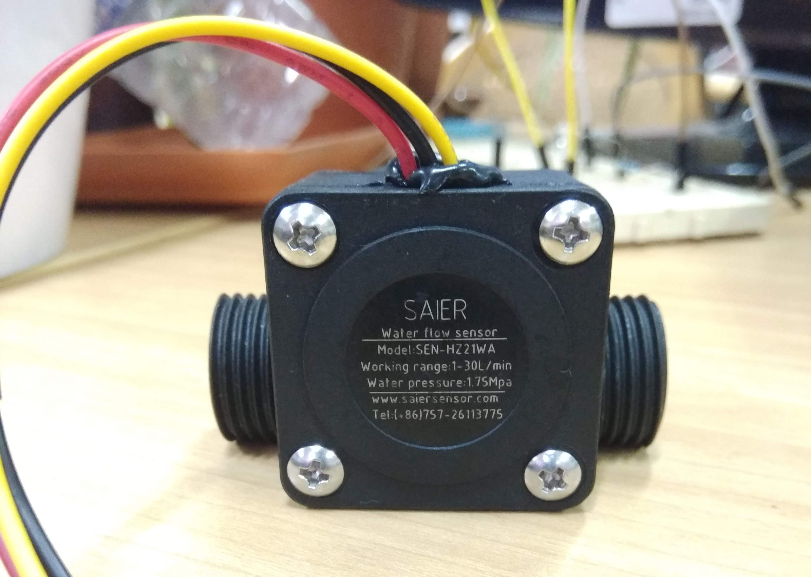

# Interfacing a flow meter

## Overview

The flow meter generates pulses on the output signal pin and we can count these pulses to
determine the quantity of fluid passing through it.

We define a function that gets called in ISR context when it encounters an (negative)
edge on the data pin.

### Documentation

1. https://saiersensor.en.alibaba.com/product/60539487700-803861114/SEN_HZ21WA_flow_sensor_liquid_level_sensor_magnetic_water_flow_sensor.html
2. https://www.e-gizmo.net/oc/kits%20documents/SEN-HZ21WA%20Flowmeter/SEN-HZ21WA%20Flowmeter.pdf
3. https://mongoose-os.com/docs/mongoose-os/api/core/mgos_gpio.h.md#mgos_gpio_set_int_handler_isr
